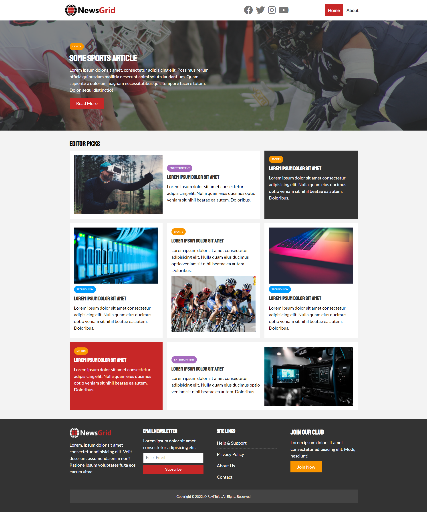

# News_Website
Building a News Website using Grid functionality


> This project build with HTML,CSS and this page consist of all list of categories which exist in news papers and news website. With the help of CSS Grid  and CSS LESS Website has been developed.

## Live Server

In the following link, you can view (Coming Soon)).

## Screenshot



Additional description about the project and its features.

## Built With

HTML and CSS
Using Grid etc

## Live Demo
[Live Demo Link](https://ravitejam9602.github.io/News_Website)

## Getting Started

**This is an example of how you may give instructions on setting up your project locally.**


To get a local copy up and running follow these simple example steps.

### Prerequisites
Grid, Flexbox, Images (Concepts in CSS)

### Setup
To get a local copy follow these steps:

1. Clone the repo by typing on your terminal

```
git clone git@github.com:RaviTejaM9602/News_Website.git
```

2. Access the repo with

```
cd Conference
```

3. Clone the Repo or Download the Zip file
Run the live server or simply open index.html with your browser.

```
code .
```


## Authors

👤 **Author1**

- GitHub: [@githubhandle](https://github.com/RaviTejaM9602/News_Website)
- Twitter: [@twitterhandle](https://twitter.com/RaviTejaMekala1)
- LinkedIn: [LinkedIn](https://www.linkedin.com/in/ravi-teja-8499a31b9/)

## 🤝 Contributing

Contributions, issues, and feature requests are welcome!

Feel free to check the [issues page](../../issues/).

## Show your support

Give a ⭐️ if you like this project!

## Acknowledgments

Microverse

## 📝 License

This project is [MIT](./MIT.md) licensed.
Ravi Teja


